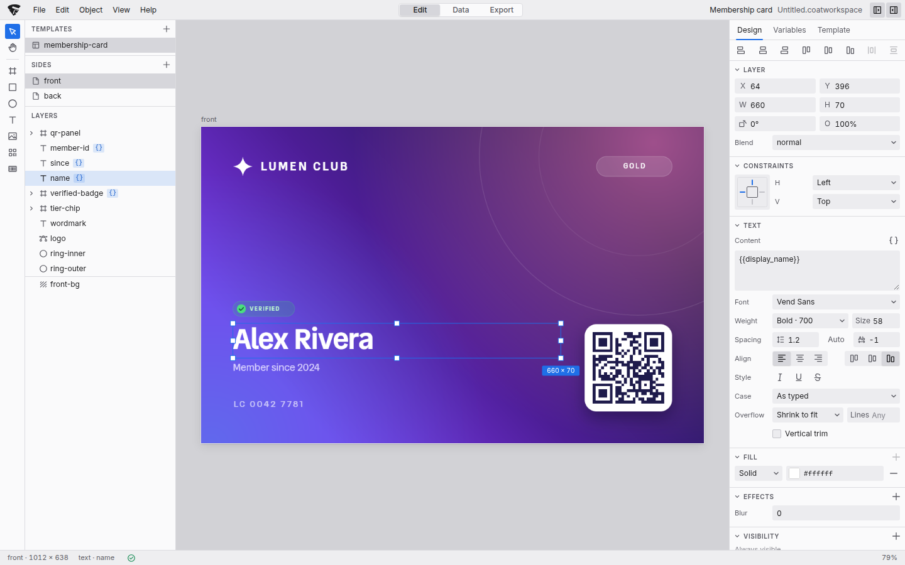

<h1>
  <picture>
    <source media="(prefers-color-scheme: dark)" srcset="../../brand/freshcoat-studio-logo-dark.svg">
    
  </picture>
</h1>

Freshcoat Studio is a browser editor for designs filled from data: cards,
badges, certificates, labels and watermarked photos. Build a template, preview
it with real records, and export the selected records, sides and variants as
images or PDFs.

Layers, snapping and an inspector handle the design. Typed datasets and field
bindings handle the changing content. Export presets keep the dimensions,
formats and file names ready for the next run.



A workspace holds templates, their data and export presets. Save the whole
project as a `.coatworkspace`, or share an individual template as a `.coat`.
The editor has three sections, switched from the
menu bar or with Ctrl/Cmd+1, 2 and 3:

- **Edit** designs a template;
- **Data** keeps the records;
- **Export** turns templates and records into files.

Editing and rendering run in the browser without an account or a rendering
server. Imported files stay in browser storage, and unsaved work is autosaved
to IndexedDB. Fonts and images referenced by URL are fetched from their hosts;
the interface fonts are bundled.

The canvas and exports use the same reusable packages:
[`@freshcoat-js/coatfile`](../../packages/coatfile) compiles templates, and
[`@freshcoat-js/engine`](../../packages/engine) lays out and paints them with CanvasKit.
See [performance](docs/performance.md) for measurements of live editing
and batch exports.

## Quick start

You need [Bun](https://bun.sh) 1.3.13 or later. Install from the repository
root:

```sh
bun install
bun run dev                                    # http://localhost:3010
```

Open <http://localhost:3010>, pick a sample or a starter on the welcome
screen, and start editing. Press `?` to list the keyboard shortcuts.

For a first batch, use a card or badge starter. Edit its design in **Edit**,
import your records in **Data**, and bind dataset columns to the template's
fields. Preview a few records to check wrapping and photo crops, then choose
the records and output settings in **Export**. You can also open a `.coat`
exported by [Freshcoat for Figma](../figma-plugin/).

```sh
bun run build                                  # static site in apps/editor/dist
bun run --cwd apps/editor test                 # unit tests (vitest)
bun run --cwd apps/editor typecheck
```

The [Studio contribution guide](CONTRIBUTING.md) covers scripts, browser tests,
benchmarks and copy conventions. The [repository guide](../../CONTRIBUTING.md)
covers shared checks and pull requests.

## What it does

- **Design:** frames, shapes, text, images, QR codes and barcodes (Code 128,
  EAN-13, UPC-A, Code 39, ITF-14, PDF417, Data Matrix, Aztec). Move, resize
  and rotate with snapping, edit gradients with handles on the canvas, set
  constraints for resizing, and choose fonts from the bundled Google Fonts
  catalog snapshot. Pasted SVG becomes editable layers, an SVG image or
  text; SVG files stay vector as images.
- **Variants:** one design in several versions, such as a card in three
  colors or a badge for speakers and staff. Pick a variant in the left panel,
  below Sides, and edit it on the canvas and in the inspector as you would the
  default: each change is recorded as that variant's own, marked, and can be
  reset. A variant can recolor, move, resize, turn, fade or hide a layer, and
  an export can produce every record in every variant.
- **Fields and data:** a template's fields bind to a dataset's columns, a
  fixed value or a pattern. Datasets have typed columns and import from CSV,
  TSV, Excel, `.ods`, `.numbers`, JSON and NDJSON through a mapping wizard.
  Step through real records on the canvas while you design.
- **Photos:** import hundreds of camera photos from files, zips or folders,
  browse them in a gallery, and export each one watermarked at its own size.
  Export uses a bounded queue of active renders and finished outputs.
- **Export:** presets pick a template, records, sides, size and format (PNG,
  JPEG or WebP zips, or a PDF). A pool of workers renders in parallel, and
  writes to a download, a zip file or a folder as it goes. PDFs can lay cards
  out on sheets of paper with crop marks and duplex backs.
- **Print:** an optional card printer path through `@freshcoat-js/for-print`, with measured
  print profiles and a preview of the file sent to the printer.
- **Starters:** a Davi card (landscape and portrait), a photo watermark and an
  event badge with Speaker and Staff variants, each with a preset ready to
  export.
- **Files:** a whole workspace saves as one `.coatworkspace` file. Templates
  open and save as `.coat` or `.coat.json`, and files saved before the rename
  (`.tkit` and `.tkit.json`) still open.
- **Links:** the URL says which section, template, side and record is shown,
  so a reload comes back to the same place.
- **Everywhere:** one undo step per command, a shortcut for everything, light
  and dark themes with tested token contrast, and usable on a tablet from
  about 1024px wide.

[docs/features.md](docs/features.md) describes each of these in full.

## Documentation

| Document | What is in it |
|---|---|
| [docs/features.md](docs/features.md) | Every feature in detail, the URL scheme and the `.coatworkspace` format |
| [Studio architecture](ARCHITECTURE.md) | Editor data flow, controller, render sessions, workers and routes |
| [Studio contribution guide](CONTRIBUTING.md) | Editor scripts, browser tests, copy conventions and extension points |
| [docs/good-first-issues.md](docs/good-first-issues.md) | Small, concrete tasks to start with |
| [docs/performance.md](docs/performance.md) | Benchmarks and what they show |
| [SECURITY.md](../../SECURITY.md) | How to report a vulnerability |
| [CODE_OF_CONDUCT.md](../../CODE_OF_CONDUCT.md) | How we treat each other |

## Known limits

- Mixed-style text (spans) is edited in the inspector, not on the canvas;
  double-clicking one focuses its content field. The on-canvas editor for plain
  text draws in the browser, so its line breaks can differ slightly from the
  render until the edit ends.
- Datasets cannot be joined or filtered by a query; an export takes one
  dataset per template.
- A layer whose ancestor is rotated can be selected and edited in the
  inspector, but it cannot be dragged on the canvas.
- Holding Alt while dragging duplicates the selection. The copies show in the
  layer tree only when the drag ends.
- The Zip file and Folder destinations need the File System Access API.
  Where it is unavailable, those destinations are disabled with an explanatory
  tooltip; use Download instead.
- Google Fonts named by a template are fetched from Google, so they need a
  network connection; the editor's own fonts are bundled. The font picker's
  previews come from Google too: offline, the list still opens and every row
  falls back to the interface font.
- The font picker's catalog is a committed snapshot, so it lists families
  offline and can fall behind Google's. `bun run fonts:update` in
  `apps/editor` refreshes it.
- Phone widths are not supported. Below about 720px the menu bar and the
  section toolbars do not fit, and at 390px the page scrolls sideways.
- Print output is for-print's correction for Davi's card printers, not ICC
  color management or soft-proofing. The printer file preview is the file that
  is sent, not a proof of the printed card.
- Zips are written without zip64, so one zip, or one part of a split download,
  must stay under 4 GB and 65,535 files. A job that would pass that fails
  rather than writing a broken zip; Download's 512 MB parts stay well inside
  it.
- Sheets place cards at trim size. Templates have no bleed area, so a design
  that runs to the edge needs a clean cut, or a 0 mm gap with a background
  that forgives a slightly short one.
- Sheets are a PDF feature. PNG, JPEG and WebP presets are one file per card
  side. Sheets also need Template size: a preset sized from each photo (Match
  image) can't be imposed, since every slot is the template's size and a
  photo's aspect would be stretched.
- On the canvas, a barcode's modules snap to whole screen pixels as an
  export's do, so at a low zoom, where a module is under two pixels, a code can
  draw well inside its box (a module of 1.9 pixels draws as 1). At print
  density a module is many pixels, and the code fills its box within a few
  percent.
- ITF-14 is drawn without its bearer bars (the frame around the code), which
  some retail scanners expect on corrugated cartons.

## Serving Studio

`bun run build` at the repository root builds this app into `apps/editor/dist`.
The static Bun server at `server.ts` serves that output with an `index.html`
fallback, so direct links to editor routes load correctly.

```sh
bun apps/editor/server.ts
```

Run that command from the repository root; the server defaults to port 3000
and reads `PORT` when provided. The root [Dockerfile](../../Dockerfile) packages
the build and server, using the whole repository as its build context.
The deployment entry files stay at the root for the existing configuration;
they deploy Studio, not the SDK packages or Figma plugin.

For the other components, see the [repository architecture](../../ARCHITECTURE.md).

## License

Freshcoat is licensed under the [Apache License 2.0](../../LICENSE). Copyright 2026
Dotside Studios; see [NOTICE](../../NOTICE).

The core SDK packages have their own LICENSE and NOTICE and are prepared
for npm publication through the [release tooling](../../docs/releases.md).
Studio itself remains a private workspace application.
Third-party software and fonts are listed
in [THIRD_PARTY_NOTICES.md](../../THIRD_PARTY_NOTICES.md). The license grants no
rights in the Freshcoat and Davi names, logos or wordmark: see
[NAMES-AND-LOGOS.md](../../NAMES-AND-LOGOS.md).
